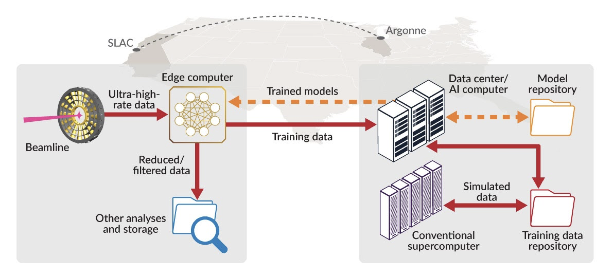
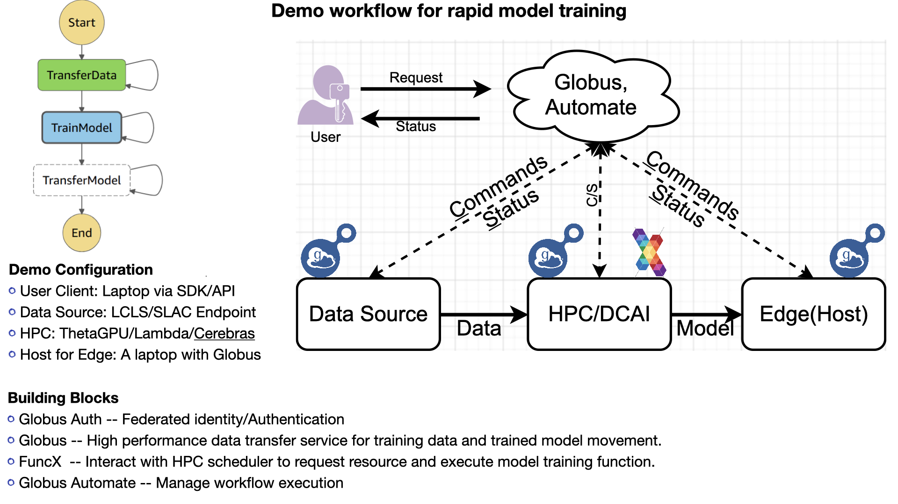

# DNNTrainerFlow
A demonstration of an automatic workflow for rapid DNN training using remote AI system resource.

The sample DNN used in the demo can be obtained from [BraggNN](https://github.com/lzhengchun/BraggNN)

# The big picture

# The implementation 

